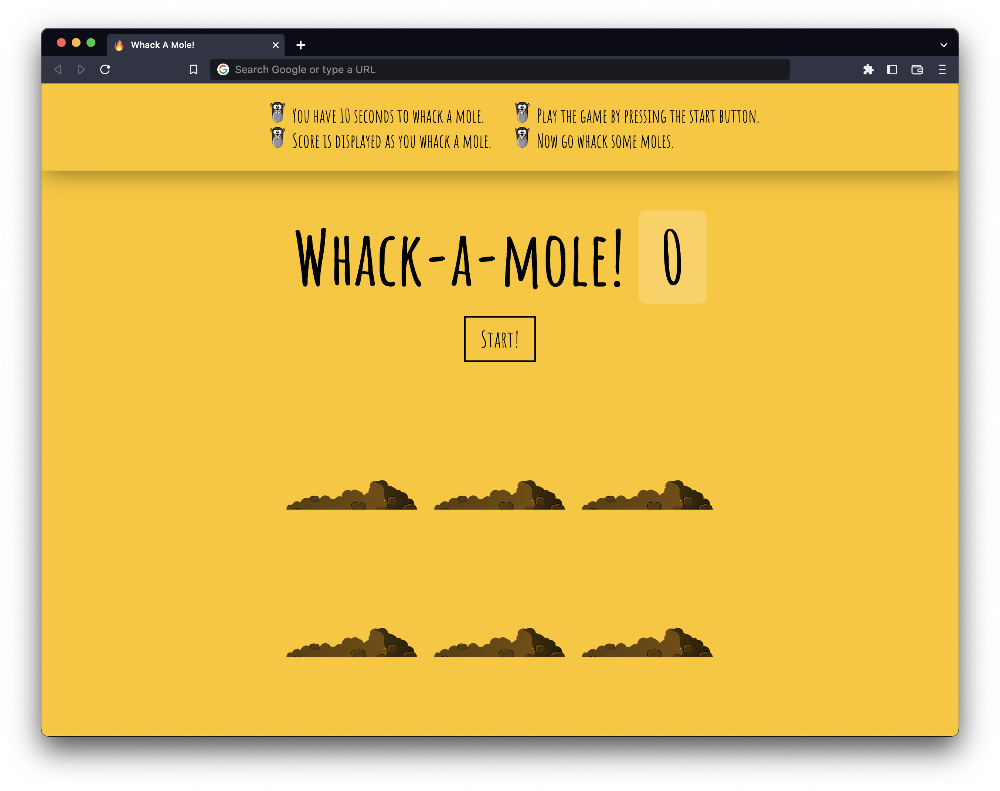

# Whack a mole 

- Whack a mole is a simple game made with vanilla JavaScript that enables you to whack a mole by clicking the randomly poping moles from the six holes. You will have 10 seconds to play the game.
- Check the live demo [HERE](https://amanworku.github.io/whack-a-mole-game/)

